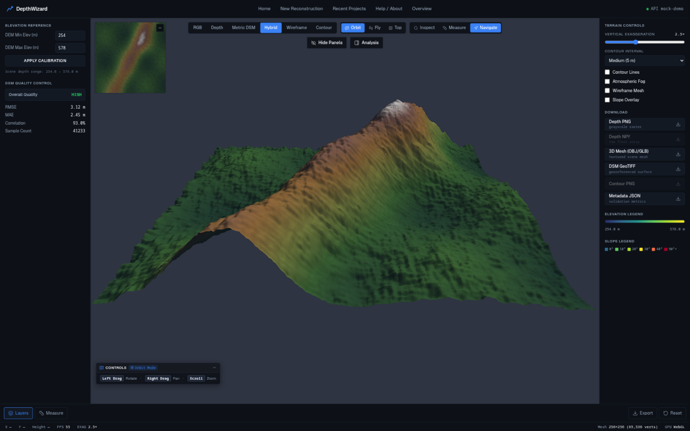
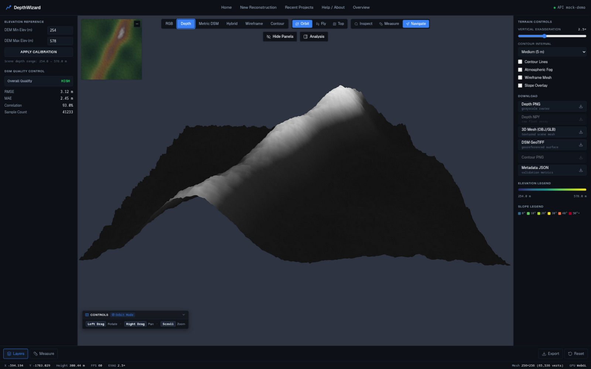
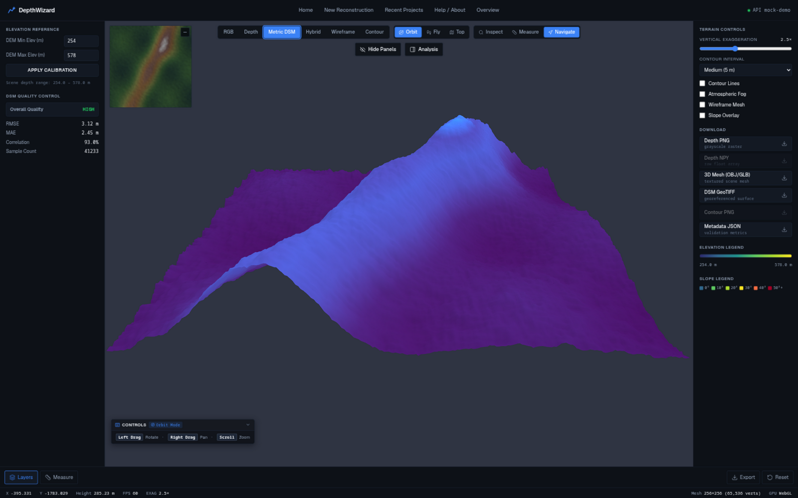
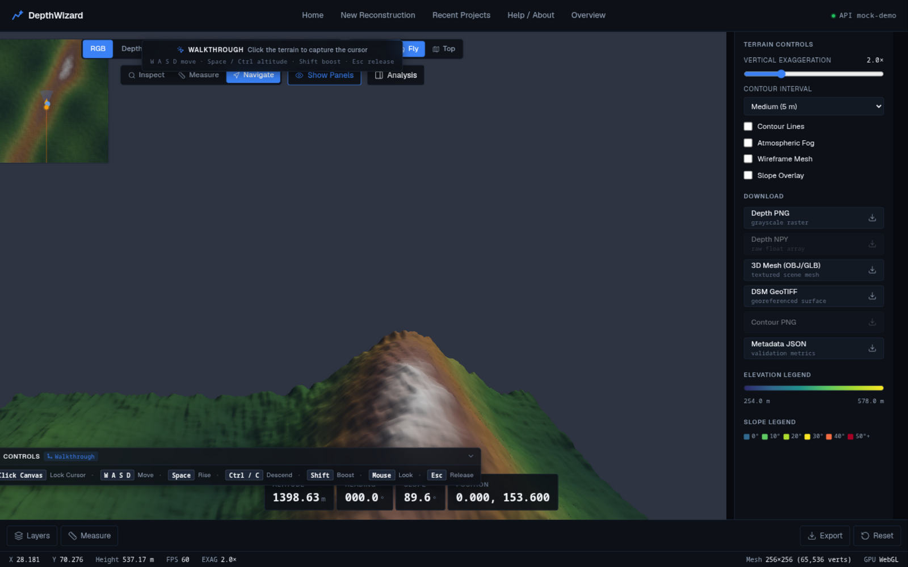

# DepthWizard

Monocular (single-view) height estimation from aerial or satellite imagery:
a frozen **Depth Anything V2** backbone produces relative depth, a
**calibration/height network** converts it into per-pixel above-ground-level
(AGL) height in metres, and optional DEM anchoring turns that into an
absolute DSM — served through a FastAPI + React stack with an interactive 3D
terrain workspace.

SIH 26175 prototype / research-engineering project. Predictions are **not**
ground-truth-quality elevation; the project is explicit about what is
learned, what is arithmetic, and what is anchored — see
[Limitations and honesty contracts](#limitations-and-honesty-contracts).

## What it does

```text
aerial/satellite image (PNG/JPG/GeoTIFF)
        ↓  upload (scene)
Depth Anything V2            (frozen monocular depth backbone)
        ↓  relative depth
normalization                (per-tile min-max / raw×scale — per backend contract)
        ↓
height model                 RDAH-Net (pretrained, default)
                             or CalibrationNet (legacy affine)
        ↓  per-pixel AGL height (metres)
post-processing              (median / guided / bilateral / WLS / TTA — optional)
        ↓
DSM generation               GeoTIFF when input is georeferenced, else relative
        ↓
optional anchoring           DEM or constant datum — arithmetic, labelled
        ↓  "ANCHORED (not learned)"
validation                   reference-DEM metrics (RMSE/MAE/bias) when a
        ↓                     reference raster is available
object storage + presigned access (RustFS, S3 API)
        ↓
3D terrain workspace         orbit / walkthrough, layers, measurement, export
```

The three elevation concepts are kept distinct everywhere in the product:

| Concept | Meaning | Label in the product |
| --- | --- | --- |
| Relative depth | Scale-free DAv2 output | — |
| AGL / nDSM | Above-ground height in metres (model output) | `nDSM`, `height_type: nDSM` |
| Absolute DSM | AGL + ground datum (**arithmetic**, not learned) | `ANCHORED (not learned)` |

## Key features

- **Single-image processing jobs** — upload imagery, watch the pipeline
  stage-by-stage, cancel cooperatively at any checkpoint.
- **Two switchable height-model backends** — pretrained RDAH-Net (default)
  and the legacy CalibrationNet, switchable from the web UI, config, or CLI;
  the choice is persisted per job and reused for refinements.
- **3D terrain workspace** — custom three.js engine: quadtree LOD tile
  streaming, orbit and first-person walkthrough modes, camera minimap.
- **Analysis tools** — elevation probe, distance/height/slope measurement,
  semantic inspection, route risk, passability (disaster) assessment, and a
  detail mode that re-processes a selected bbox at source resolution.
- **Validation** — when a scene carries a reference DEM, metrics (RMSE, MAE,
  median error, bias, correlation) and an error map are produced and served.
- **Honest geospatial handling** — CRS/transform are propagated when present
  and reported as `UNKNOWN` when absent; nothing georeferenced is invented.
- **Durable results** — every artifact is persisted to object storage and
  re-materialized on demand; results survive backend restarts.
- **Native raster acceleration** — C++ SIMD kernels for the serving hot
  paths, with a bit-compatible pure-Python fallback.

## Demo / screenshots

| | |
| --- | --- |
|  |  |
|  |  |

## Architecture

```text
                ┌──────────────────────────┐
                │   React / Vite frontend  │
                │  terrain engine (three)  │
                └────────────┬─────────────┘
                             │ HTTP /api/v1
                             ▼
                ┌──────────────────────────┐
                │       FastAPI backend    │
                │  scenes · jobs · results │
                │  terrain · validation    │
                └───────┬──────────┬───────┘
                        │          │
        ┌───────────────┘          └──────────────────┐
        ▼                                             ▼
┌──────────────────────┐                    ┌──────────────────┐
│  depthwizard (ML)    │                    │  RustFS          │
│  DAv2 + height model │  upload/presign    │  S3-compatible   │
│  → AGL → DSM         │◀───── boto3 ──────▶│  object store    │
└──────────────────────┘                    └──────────────────┘
        │                                             ▲
        ▼                                             │ presigned URLs
┌──────────────────────┐                             │ (browser-facing)
│ DSM / terrain tiles  │─────────────────────────────┘
└──────────────────────┘
```

- Object storage is **RustFS** — a self-hosted server providing the
  S3-compatible API used by the application. The project is **not**
  dependent on AWS S3; any S3-compatible endpoint works.
- Data operations use the internal endpoint (`http://rustfs:9000` inside
  Docker); **presigned URLs are signed against the browser-facing endpoint**
  (`S3_PUBLIC_ENDPOINT`, default `http://localhost:9000`) so the signature
  matches the Host header the browser sends.
- Objects persist in the `rustfs_data` Docker volume and survive restarts.

## Quick start

```bash
git clone <repository-url>
cd SIH_26175

./dw setup      # detect prerequisites, configure, install, verify
./dw start      # launch backend + frontend (Ctrl+C stops everything)
```

Then open:

| | |
| --- | --- |
| Frontend | http://localhost:5173 |
| Backend | http://localhost:8010 |
| API docs | http://localhost:8010/docs |
| RustFS console | http://localhost:9001 (S3 API: http://localhost:9000) |

Windows: use `dw.cmd setup` / `dw.cmd start`.

`dw setup` configures the zero-config local default
(`DATABASE_URL=sqlite:///data/depthwizard.db`) — no Supabase or external
PostgreSQL is required to run the demo.

## Prerequisites

| Requirement | Version | Notes |
| ----------- | ------- | ----- |
| Python | ≥ 3.12 | `pyproject.toml` |
| uv | any recent | Python dependency manager; `dw setup` offers a user-level install |
| Node.js + npm | LTS | frontend; `dw setup` detects and prints install instructions |
| Docker + Compose | recent | runs RustFS (and the optional compose deployment) |
| C/C++ compiler + CMake | optional | for the native extension; pure-Python fallback otherwise |
| Internet access | — | first-time model downloads (see below) |

The CLI runs on Linux, macOS and Windows and never uses sudo/admin rights:
OS-level packages are always installed by you, with instructions printed.

## Master CLI

```bash
./dw doctor              # read-only diagnostics (--verbose for detail)
./dw setup               # bootstrap everything; idempotent and resumable
./dw start               # preflight, then hand over to scripts/start.py
./dw test                # config + RustFS roundtrip + backend_tests
./dw test --full         # + model_tests + a real inference on the demo tile
./dw status              # component table + URLs
./dw logs rustfs         # rustfs | backend | frontend | all
./dw stop                # stop dev processes (deletes nothing)
./dw restart             # stop + start
./dw clean --cache       # --cache | --deps | --data | --all (destructive:
                         #  confirmed by typing "delete"; --yes never bypasses)
```

`dw setup --yes` auto-accepts normal install/download confirmations.
`dw start` detects an already-running backend and refuses to launch
duplicates; it never performs privileged system installation — missing
OS-level prerequisites stop it with exact per-platform instructions.

## What `dw setup` does

```text
detect prerequisites → create/configure .env (SQLite default)
        ↓
uv sync (Python deps) → npm ci (frontend deps)
        ↓
docker compose config validation
        ↓
start RustFS → verify bucket + upload/download/presign roundtrip
        ↓
prepare model assets (checkpoint downloads, confirmed)
        ↓
native extension build (via scripts/start.py; optional)
        ↓
readiness report
```

Large first-time downloads, always confirmed before starting:

| Asset | Size | Destination |
| ----- | ---- | ----------- |
| PyTorch + CUDA wheels (first `uv sync` only) | ~2–4 GB | `.venv` (uv cache) |
| Depth Anything V2 weights | 0.3–1.3 GB | `~/.cache/huggingface/hub/` |
| RDAH-Net released checkpoint | ~65 MB | `checkpoints/rdah/` (MD5-verified) |
| RustFS Docker image | ~60 MB | Docker |

## ML pipeline

The serving default (RDAH-Net):

```text
RGB → Depth Anything V2 (frozen, ViT-B)
    → raw relative depth × depth_scale (RDAH contract)
    → RDAH-Net HeightPredTransformer → unclamped nDSM (metres)
    → optional anchoring (DEM or constant datum) → absolute DSM
```

The legacy CalibrationNet backend normalizes depth per 1024-tile
(min-max) and predicts `H = clamp(a·Dn + b, 0)` with per-tile affine
parameters. Both backends share the identical downstream path — tiling,
anchoring, post-processing, DSM writer, storage — and the backend reports
which one produced a result (`model_architecture`, `model_tag` in every
payload).

- **Datasets (training/research):** GAMUS (HDF5, lazy Hugging Face
  download) and DFC2019, with a mixing abstraction
  (`depthwizard/datasets/`). The dataset itself is not in git.
- **Training/evaluation:** `python model.py train | evaluate | depth |
  bench` with configs under `configs/`. Citable numbers come **only** from
  `evaluate` — the serving UI is a demo, not an evaluation tool.
- Depth inputs are never silently re-normalized: each backend documents its
  exact depth contract, and RDAH rejects DEM/semantic inputs loudly rather
  than dropping them.

Deep training procedures and the experiment ladder live in
[Model.md](Model.md) and [configs/](configs/).

## Backend

FastAPI + Pydantic (strict schemas — unknown request fields are rejected
with 422), SQLAlchemy persistence (SQLite locally; PostgreSQL/Supabase
optional), durable job records with cooperative cancellation and lease
heartbeats, and an artifact store with read-through caching against object
storage.

Principal `/api/v1` route groups (see `/docs` for the full contract):

| Group | Purpose |
| ----- | ------- |
| `health` | liveness/readiness, `model_loaded` honesty |
| `scenes` | upload (single/batch/mosaic), listing, deletion |
| `jobs` | process / refine / poll / cancel |
| `results` | per-scene result payloads and artifact files |
| `terrain` | quadtree height tiles for the 3D engine |
| `semantic` | segmentation layers for the scene |
| `validation` | reference-DEM metrics and error maps |
| `reference` | reference DEM management |
| `route` | route risk analysis |
| `export` | artifact export via presigned URLs |

In host-side development the backend listens on **8010** (`DW_PORT`); the
docker-compose deployment publishes **8000**. Both are real, separate
modes.

## Frontend

React 19 + Vite with a custom three.js terrain engine
(`frontend/src/engine/`): quadtree LOD tile streaming, orbit and
first-person walkthrough cameras, a minimap that doubles as navigation,
layer controls (RGB / depth / metric DSM / slope), and an analysis suite
(`frontend/src/components/Analysis/`): elevation probe, distance,
height and slope measurement, semantic inspection, route assist with risk
overlay, passability/disaster assessment, and bbox detail refinement.
Validation views render reference comparisons and error maps; an export
panel downloads artifacts. Archived/experimental components live under
`frontend/src/components/_archived/` and are not part of the product.

## Object storage

```text
FastAPI → S3Storage / StorageService → boto3 (S3v4) → RustFS → rustfs_data volume
```

- S3 API: http://localhost:9000 · Console: http://localhost:9001
- Default bucket: `depthwizard` — created automatically at backend startup
  (idempotent; never deletes).
- Presigned artifact URLs are short-lived and signed against
  `S3_PUBLIC_ENDPOINT` (the browser-facing host); data operations use the
  internal endpoint. Credentials never leave the server.
- RustFS provides the S3-compatible API used by the application — it is not
  AWS S3 and requires no license.

## Native acceleration

`native/` implements the serving stack's measured CPU hotspots as C++ SIMD
kernels exposed through pybind11
([native/README.md](native/README.md)):

| kernel | role | NumPy | native | speedup |
| --- | --- | --- | --- | --- |
| `fill_invalid` | NaN/Inf hole fill (height tiles, layer PNGs) | 620 ms | 17.5 ms | ×35 |
| `stretch_to_01` + `quantize_u8` | normalization + PNG encode prep | 29.5 ms | 7.7 ms | ×3.8 |

(Benchmarked on the reference 2540×2180 demo DSM; numbers from
[native/README.md](native/README.md).) The extension is optional: if it is
missing or fails to build, `backend/app/services/native_accel.py` falls
back to bit-compatible pure-Python implementations and the application
works unchanged. `scripts/start.py` builds it automatically when a
toolchain is available.

## Project structure

```text
.
├── backend/            # FastAPI application (backend.app.main:app)
│   └── app/{api,services,storage,db,core,schemas,jobs}
├── frontend/           # React/Vite app + three.js terrain engine
├── depthwizard/        # ML library: backbone, height models, datasets, CLIs
├── native/             # C++ SIMD kernels (pybind11) + build
├── scripts/            # start.py (stack runner), dw.py (master CLI)
├── configs/            # ML experiment/training configs
├── backend_tests/      # backend API/service tests
├── model_tests/        # ML core tests
├── tests/              # pipeline tests
├── docs/               # docs + screenshots
├── data/               # local runtime data (gitignored)
├── outputs/            # model outputs / checkpoints
├── docker-compose.yml  # rustfs + backend + frontend
├── pyproject.toml      # Python project + uv lockfile
├── Model.md            # deep ML/training documentation
└── dw, dw.cmd          # master CLI entry points
```

## Configuration

Key environment variables (all in `.env`; see `.env.example` for the full
set — the file contains only development placeholders):

| Variable | Default | Purpose |
| -------- | ------- | ------- |
| `DATABASE_URL` | `sqlite:///data/depthwizard.db` | persistence (SQLite locally; PostgreSQL/Supabase optional) |
| `STORAGE_BACKEND` | `s3` | `s3` (RustFS/any S3) or `local` (dev fallback) |
| `S3_ENDPOINT` | `localhost:9000` | backend → storage endpoint (internal) |
| `S3_PUBLIC_ENDPOINT` | unset | browser-facing endpoint for presigned URLs |
| `S3_ACCESS_KEY` / `S3_SECRET_KEY` | dev placeholders | object-store credentials |
| `S3_BUCKET` | `depthwizard` | object bucket (auto-created) |
| `DW_CKPT` | unset | serving checkpoint override (resolution order below) |
| `DW_CKPT_RDAH` | unset | fine-tuned RDAH checkpoint override |
| `DW_CKPT_SHA256` | unset | optional checkpoint integrity pin |
| `DW_DEVICE` | `auto` | `cuda` / `cpu` / `auto` |
| `DW_BACKBONE` | `depth-anything/Depth-Anything-V2-Base-hf` | live DAv2 model |
| `DW_CORS_ORIGINS` | `http://localhost:5173,http://127.0.0.1:5173` | explicit allowlist (never `*`) |
| `DW_API_KEY` | unset | when set, `/api/v1` (except health) requires `X-API-Key` |
| `DW_MAX_UPLOAD_BYTES` | 500 MB | upload cap |
| `DW_MAX_CONCURRENT_JOBS` | 1 | simultaneous inference runs |
| `STORAGE_SIGNED_URL_TTL` | 300 s | presigned URL lifetime |

Serving checkpoint resolution order: `DW_CKPT` →
`outputs/calib_net/postproc_flagship/best.pt` → `./best.pt`.
RDAH resolution: `DW_CKPT_RDAH` → the released Track1 checkpoint
(auto-downloaded and MD5-verified on first use).

## Docker

`docker-compose.yml` defines three services: `rustfs` (object storage,
health-checked), `backend`, and `frontend`, with the `rustfs_data` named
volume for persistence.

```bash
docker compose up --build
# backend  -> http://localhost:8000
# RustFS   -> http://localhost:9000 (console :9001)
```

This is the containerized alternative. For interactive development prefer
`./dw start`, which runs the backend and frontend as local processes with
hot reload.

## Testing

```bash
./dw test                  # config + RustFS roundtrip + backend_tests
./dw test --full           # + model_tests + real inference on the demo tile
uv run pytest backend_tests   # backend suite only
uv run pytest model_tests     # ML core suite only
uv run pytest tests            # pipeline tests
```

`backend_tests` exercise the API and services against fakes/in-memory
stores (fast, no GPU). `model_tests` cover the ML core, including
checkpoint-loading and inference contracts, using tiny synthetic
checkpoints. `--full` additionally runs a real end-to-end inference on
`demo_DC_02_26.png`.

## Troubleshooting

| Symptom | Fix |
| ------- | --- |
| Docker daemon not running | start Docker Desktop / `sudo systemctl start docker`; `dw doctor` re-checks |
| Missing model weights | `./dw setup` (downloads are confirmed, then cached) |
| Port already in use | `./dw status` then `./dw stop`; `dw start` refuses duplicates |
| RustFS unreachable | `./dw logs rustfs` or `docker compose logs rustfs` |
| Native build failed | harmless — the pure-Python fallback is used automatically |
| Slow first run | the first `uv sync` and model downloads are one-time costs |
| Checkpoint missing (`model_loaded: false`) | point `DW_CKPT`/`DW_CKPT_RDAH` at a checkpoint or run `./dw setup` |

## Limitations and honesty contracts

These are enforced in the product and must be preserved:

- **Citable numbers come only from `evaluate`.** The serving UI and CLI
  `infer` are demos; they never print evaluation metrics.
- **Anchoring is arithmetic, not learned.** Absolute DSMs built from a DEM
  or constant datum are always labelled `ANCHORED (not learned)`.
- **Predictions are not ground truth.** AGL/nDSM output is labelled
  `nDSM` and is never presented as surveyed elevation.
- **Slope is only reported when real GSD is available**; georeference is
  propagated when present and reported `UNKNOWN` otherwise — no CRS is
  ever invented.
- **Missing artifacts fail honestly.** Validation metrics exist only when a
  reference raster exists; absent results are reported as absent.
- **RDAH output is unclamped.** Unlike CalibrationNet (`clamp ≥ 0`), RDAH's
  nDSM may dip slightly below zero — reported, never silently clamped.
- Some training architectures/experiments remain gated or deferred; the
  registry rejects unsupported combinations loudly instead of guessing.

## Contributing / development

```bash
./dw setup     # one-time environment bootstrap
./dw start     # run the stack
./dw test      # fast suite; --full for ML + inference
```

Where to make changes:

| Area | Location |
| --- | --- |
| Backend API/services | `backend/app/` (+ `backend_tests/`) |
| Frontend / terrain engine | `frontend/src/` |
| ML library, CLIs | `depthwizard/`, `model.py` (+ `model_tests/`) |
| Native kernels | `native/src/` (+ rebuild via `python native/build.py`) |
| Configuration | `.env.example`, `backend/app/core/config.py` |
| Deep ML documentation | `Model.md`, `docs/` |

## License

No license file is currently included in the repository.
