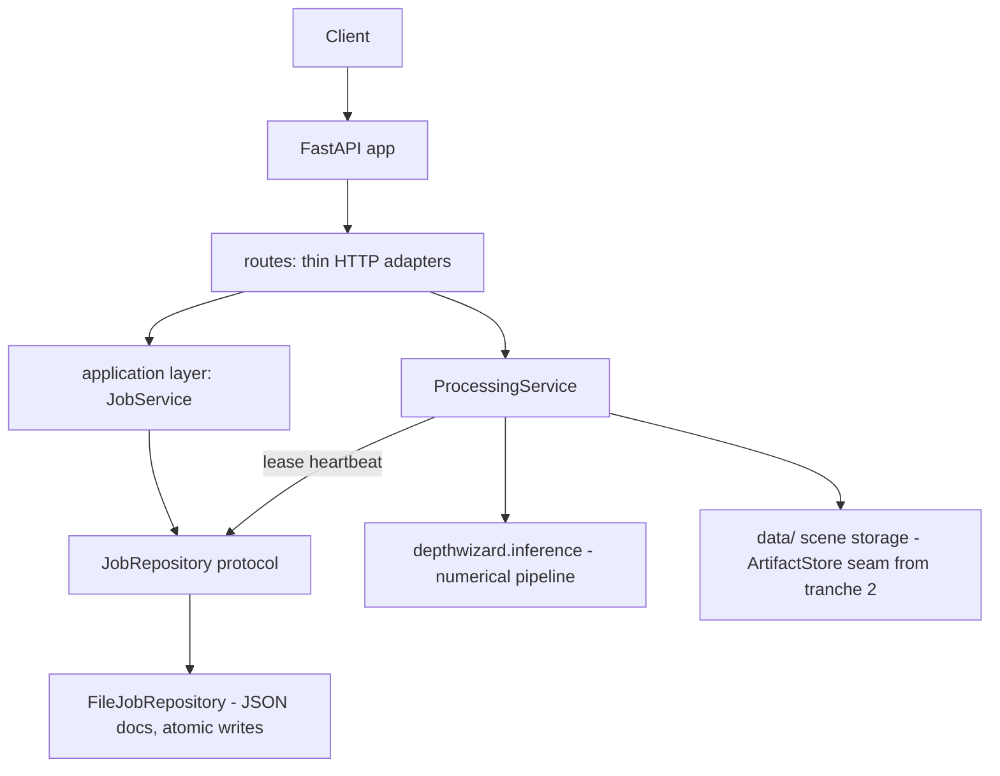

# Backend Architecture & Stateless Deployment

Status after **tranche 1** of the statelessness refactor (2026-09-17).
Audit: `docs/backend_architecture_audit.md`. Migration plan: §4 there.

## 1. Architecture



Dependency direction (enforced): `routes → application → domain ←
infrastructure`. The domain package imports no framework. The ML layer
(`depthwizard.*`) imports nothing from `backend.*` — the backend calls it
through `run_inference`, which will become a protocol boundary in
tranche 3.

## 2. New interfaces

| Interface | Location | Implementations |
|---|---|---|
| `Job` entity | `backend/app/domain/entities.py` | canonical record for API schema + persistence |
| `JobRepository` | `backend/app/domain/protocols.py` | `FileJobRepository` (JSON per scene dir); Postgres planned |
| `ArtifactStore` | `backend/app/domain/protocols.py` | `LocalArtifactStore`; S3/MinIO planned (tranche 2) |
| `JobService` | `backend/app/application/jobs/service.py` | adds the worker-side lease heartbeat |
| `JobManager` | `backend/app/jobs/manager.py` | compatibility facade over `JobService` (old import path keeps working) |

## 3. State ownership (after tranche 1)

```text
Job JSON documents   = AUTHORITATIVE job state   (data/process/scenes/<id>/jobs/)
scene.json + inputs  = AUTHORITATIVE scene state (data/raw/scenes/<id>/)
DSM artifacts        = AUTHORITATIVE results     (data/output/scenes/<id>/)
repository index     = bookkeeping ONLY — wiping it changes no read (pinned by test)
worker RAM           = transient execution
GPU VRAM (DAv2)      = disposable cache (reloadable, correctness-independent)
```

## 4. Job lifecycle

```text
queued ──claim──▶ processing ──▶ completed
   │                  │  \──▶ failed
   │                  └──▶ cancelled   (cancel_requested honored at checkpoints)
   └──▶ cancelled      (queued cancels are immediate)
```

Liveness is DURABLE and PID-free:

* claiming (`status → processing`) writes `lease_until`, `worker_id`,
  `attempt` (+ `owner_pid` as a log-only diagnostic);
* the worker holds `job_service.lease_heartbeat(job_id)` for the whole
  run — the lease is renewed at lease/3 cadence;
* any reader of a non-terminal job whose lease expired finalizes it as
  `JOB_INTERRUPTED` (recoverable) — no sticky sessions, no "the same
  worker must survive";
* pre-lease records (PID-era) go through a one-time migration shim on
  read, then persist their terminal state.

## 5. Local development

Unchanged: `uvicorn backend.app.main:app --port 8000`. Storage roots
under `data/`, configurable knobs via `DW_*` env (`core/config.py`;
`DW_JOB_LEASE_SECONDS` new, default 1800 — must exceed the longest
inference run even without heartbeats).

## 6. Production deployment model (target)

```text
Load balancer → N stateless API containers
                 └─ shared durable store: job docs (Postgres in tranche 2+)
                    + shared artifact store (S3/MinIO in tranche 2)
                 └─ queue → M GPU workers (same image, worker entrypoint)
```

Any API instance can answer any `GET /jobs/{id}` today (pinned by
`test_cross_instance_update_visibility`); the tranche-2 queue/worker
split removes the last process-local piece (in-process job execution).

## 7. Honest limitations after tranche 1

* **In-process execution**: `BackgroundTasks` still runs inference inside
  the API process. Records survive restarts; in-flight work does not
  (finalized honestly). The TaskQueue/worker split is tranche 2.
* **Last-writer-wins job mutations**: per-file read-modify-write without
  cross-process transactions. Not a designed flow today; a DB-backed
  repository removes the caveat entirely.
* **Storage seam exists, services not yet rewired**: business logic still
  addresses artifacts via `core/paths.py` (safe, local). Tranche 2 moves
  reads/writes onto `ArtifactStore` so S3/MinIO becomes configuration.
* **Env reads** for inference-domain knobs (`DW_CKPT`, `DW_DEVICE`,
  `DW_BACKBONE`) still live in `ProcessingService` — moving to typed
  config is tranche 2.
* **ML pipeline decomposition** (`inference.py`, 981 lines) is tranche 3
  and MUST be gated on the golden regression fixture first.
