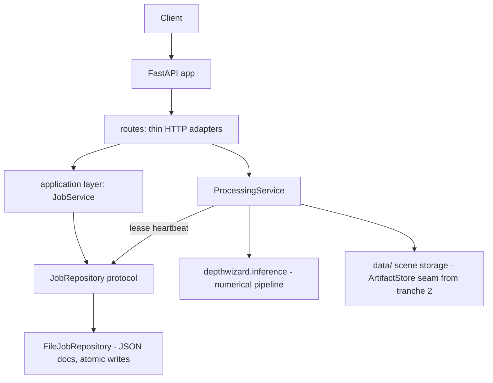

# Backend Architecture & Stateless Deployment

Status after **tranche 1** of the statelessness refactor (2026-09-17).
Audit: `docs/backend_architecture_audit.md`. Migration plan: §4 there.

## 1. Architecture



Dependency direction (enforced): `routes → application → domain ←
infrastructure`. The domain package imports no framework. The ML layer
(`depthwizard.*`) imports nothing from `backend.*` — the backend calls it
through `run_inference`, which will become a protocol boundary in
tranche 3.

## 2. New interfaces

| Interface | Location | Implementations |
|---|---|---|
| `Job` entity | `backend/app/domain/entities.py` | canonical record for API schema + persistence |
| `JobRepository` | `backend/app/domain/protocols.py` | `FileJobRepository` (JSON per scene dir); Postgres planned |
| `ArtifactStore` | `backend/app/domain/protocols.py` | `LocalArtifactStore`; S3/RustFS planned (tranche 2) |
| `JobService` | `backend/app/application/jobs/service.py` | adds the worker-side lease heartbeat |
| `JobManager` | `backend/app/jobs/manager.py` | compatibility facade over `JobService` (old import path keeps working) |

## 3. State ownership (after tranche 1)

```text
Job JSON documents   = AUTHORITATIVE job state   (data/process/scenes/<id>/jobs/)
scene.json + inputs  = AUTHORITATIVE scene state (data/raw/scenes/<id>/)
DSM artifacts        = AUTHORITATIVE results     (data/output/scenes/<id>/)
repository index     = bookkeeping ONLY — wiping it changes no read (pinned by test)
worker RAM           = transient execution
GPU VRAM (DAv2)      = disposable cache (reloadable, correctness-independent)
```

## 4. Job lifecycle

```text
queued ──claim──▶ processing ──▶ completed
   │                  │  \──▶ failed
   │                  └──▶ cancelled   (cancel_requested honored at checkpoints)
   └──▶ cancelled      (queued cancels are immediate)
```

Liveness is DURABLE and PID-free:

* claiming (`status → processing`) writes `lease_until`, `worker_id`,
  `attempt` (+ `owner_pid` as a log-only diagnostic);
* the worker holds `job_service.lease_heartbeat(job_id)` for the whole
  run — the lease is renewed at lease/3 cadence;
* any reader of a non-terminal job whose lease expired finalizes it as
  `JOB_INTERRUPTED` (recoverable) — no sticky sessions, no "the same
  worker must survive";
* pre-lease records (PID-era) go through a one-time migration shim on
  read, then persist their terminal state.

## 5. Local development

Unchanged: `uvicorn backend.app.main:app --port 8000`. Storage roots
under `data/`, configurable knobs via `DW_*` env (`core/config.py`;
`DW_JOB_LEASE_SECONDS` new, default 1800 — must exceed the longest
inference run even without heartbeats).

## 6. Production deployment model (target)

```text
Load balancer → N stateless API containers
                 └─ shared durable store: job docs (Postgres in tranche 2+)
                    + shared artifact store (S3/RustFS in tranche 2)
                 └─ queue → M GPU workers (same image, worker entrypoint)
```

Any API instance can answer any `GET /jobs/{id}` today (pinned by
`test_cross_instance_update_visibility`); the tranche-2 queue/worker
split removes the last process-local piece (in-process job execution).

## 7. Tranche 2 (delivered): execution split + config centralization

* **TaskQueue seam** (`domain/protocols.py`): request-scoped dispatch is
  `BackgroundTaskQueue` (inline dev mode — behaviorally identical to the
  pre-refactor BackgroundTasks); external mode dispatches NOTHING from
  the API.
* **External worker** (`python -m backend.app.worker`): claims queued
  jobs from the durable store (`FileJobRepository.list_queued` /
  `claim_queued`), executes them via `ProcessingService.execute_job_record`
  under a durable lease heartbeat. Validated request parameters are
  PERSISTED on the job record (`Job.request`), so a fresh worker needs
  only the record + artifacts + config.
* **Delivery semantics**: at-least-once with idempotent outputs — a
  race-window double claim re-runs the deterministic pipeline, writes
  identical artifacts, and the terminal lock refuses the loser's
  completion. Exactly-once requires the DB-backed repository.
* **Config centralization**: `DW_CKPT`, `DW_CKPT_SHA256`, `DW_DEVICE`,
  `DW_BACKBONE`, `DW_NO_LIVE`, `DW_WORKER_MODE`, `DW_WORKER_POLL_SECONDS`
  all live in `Settings` now; `ProcessingService` never reads os.environ.
* **Golden regression gate** (`model_tests/test_golden_regression.py`):
  fixed input + fixed raw Dn + fixed checkpoint -> full certified path
  (normalization, calibration, payload) pinned by a sha256 of the
  calibrated AGL. Tranche 3 cannot change it silently
  (REGEN_GOLDEN=1 to re-pin, documented).

## 8. Honest limitations after tranche 2

* **Storage seam exists, services not yet rewired**: business logic still
  addresses artifacts via `core/paths.py` (safe, local). Next tranche
  moves reads/writes onto `ArtifactStore` so S3/RustFS becomes
  configuration.
* **Last-writer-wins job mutations**: per-file read-modify-write without
  cross-process transactions; the DB-backed repository is the upgrade.
* **ML pipeline decomposition** (`inference.py`, 981 lines) is tranche 3,
  now safely gated by the golden regression test.

## 9. Localized Disaster Assessment Pipeline (HOTOSM ONNX)

DepthWizard integrates a dedicated, production-quality localized disaster assessment pipeline using two HOTOSM ONNX models:

1. **HOTOSM DINOv3 Building Localization** (`local_model.onnx`):
   - Input: RGB imagery tiled at 256×256 pixels.
   - Output: 3-class segmentation (0=building footprint, 1=road/paved, 2=background; verified against aerial imagery), building channel aggregated via sliding window into building probability masks and polygonized building footprints.
2. **HOTOSM Earthquake Damage Assessment** (`model.onnx`):
   - Input: Post-disaster RGB imagery + detected/provided building footprints + optional pre-disaster imagery (512×512 crops).
   - Output: 4-class building damage taxonomy: `no-damage`, `minor-damage`, `major-damage`, `destroyed`.

### Key Design & Safety Principles
- **Explicit Post-Only Mode**: When pre-disaster imagery is absent, the pipeline feeds a zero tensor to `pre`, sets `mode="post_only"`, and never fabricates pre-disaster imagery.
- **VRAM Safety (<6 GB)**: Models are never run concurrently; building detection completes, frees memory, and then damage assessment runs on building crops sequentially with `batch_size=1`.
- **Review Margin**: Buildings with a top-2 class probability margin < 15% are flagged with `damage_review=true` (`review_required`).
- **Separation of Taxonomies**: 4-class building damage is strictly separated from 6-class landcover semantic segmentation.
- **ONNX fp32 restore (GPU correctness)**: both HOTOSM models were exported with internal fp16 compute; on this GPU stack the fp16 attention MatMul overflows to inf/NaN. `depthwizard/disaster/graph_fp32.py` rewrites such graphs to fp32 (cached as `<model>.fp32-<hash>.onnx` beside the source) and `OnnxSession` applies it automatically before session creation. A session-level warmup probe still validates the GPU and falls back to CPU if NaNs are ever produced.
- **Destroyed-structure recovery**: the building model cannot see rubble (trained on intact footprints). After per-building assessment, a scene-wide damage pass (`map_damage_probability`) recovers destroyed areas the detector missed (`recover_destroyed_structures`); they are flagged `detection_source: "damage_map"` and `review_required: true` in the GeoJSON, and counted in `damage_meta.json` as `recovered_destroyed_areas`. Toggle with `DW_DISASTER_RECOVER_DESTROYED`.
- **Region refinement**: `refined_dsm.npy` is produced in an isolated directory (never overwriting full-scene `dsm.npy`) and registered as a result artifact.
- **Route Assist Hazard Integration**: Structural damage is converted into an obstacle/cost surface (`DW_ROUTE_DAMAGE_ENABLED`, `DW_ROUTE_DAMAGE_MINOR_COST`, `DW_ROUTE_DAMAGE_MAJOR_COST`, `DW_ROUTE_DAMAGE_DESTROYED_COST`), influencing vehicle pathfinding and excluding helicopter landing zones on destroyed structures.

### Generated Scene Artifacts
- `buildings.geojson`, `building_mask.npy`, `building_confidence.npy`, `buildings_preview.png`, `buildings_meta.json`
- `damage_buildings.geojson`, `damage_labels.npy`, `damage_confidence.npy`, `damage_preview.png`, `damage_meta.json`

### REST API Endpoints
- `GET /api/v1/scenes/{scene_id}/buildings`: Building detection metadata
- `GET /api/v1/scenes/{scene_id}/damage`: Damage assessment metadata
- `GET /api/v1/scenes/{scene_id}/results/buildings-geojson`: Building footprints GeoJSON
- `GET /api/v1/scenes/{scene_id}/results/buildings-preview`: Building footprints overlay PNG
- `GET /api/v1/scenes/{scene_id}/results/damage-geojson`: Building damage GeoJSON
- `GET /api/v1/scenes/{scene_id}/results/damage-preview`: Damage severity color overlay PNG
